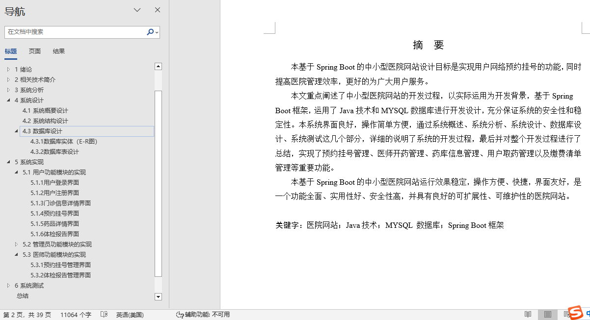
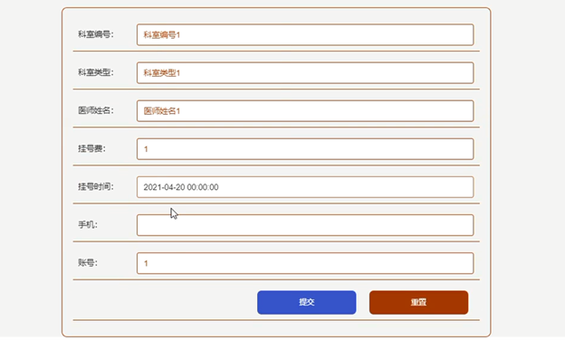
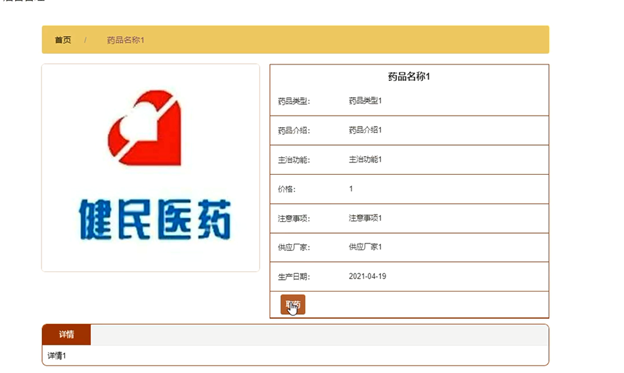
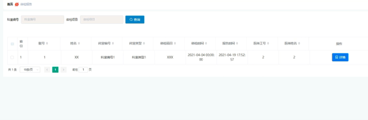
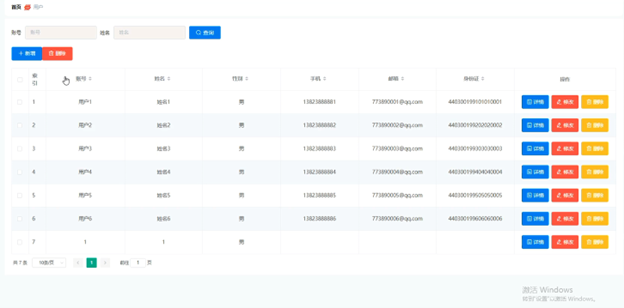
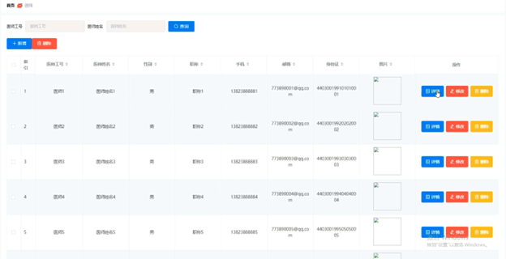
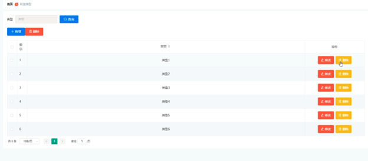
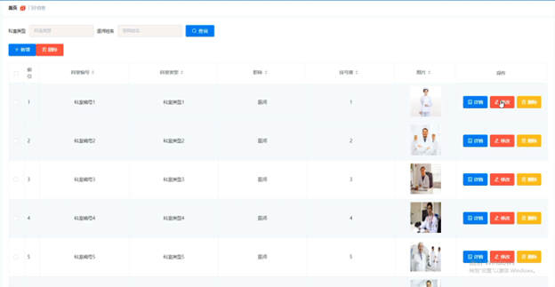

## 中小型医院网站(程序+报告)

- <b>完整代码获取地址：从戎源码网 ([https://armycodes.com/](https://armycodes.com/))</b>
- <b>技术探讨、资料分享，请加QQ群：692619798</b> 
- <b>作者微信：19941326836  QQ：952045282</b> 
- <b>承接计算机毕业设计、Java毕业设计、Python毕业设计、深度学习、机器学习</b>
- <b>选题+开题报告+任务书+程序定制+安装调试+论文+答辩ppt 一条龙服务</b>
- <b>所有选题地址 ([https://github.com/YuLin-Coder/AllProjectCatalog](https://github.com/YuLin-Coder/AllProjectCatalog)) </b>

## 项目介绍
中小型医院网站，系统包含两种角色：用户、管理员，系统分为前台和后台两大模块，主要功能如下：

1 用户功能模块的实现
- 系统信息查看：用户可以访问首页、门诊信息、药库信息以及系统公告等。
- 用户登录界面：用户登录系统以使用预约挂号功能。输入正确的账号和密码后即可登录。
- 用户注册界面：新用户可以通过注册界面创建账号。
- 门诊信息详情界面：用户可以查看门诊详情，登录后可以进行预约挂号。
- 预约挂号界面：用户填写相关数据进行预约挂号。
- 药品详情界面：用户可以查看药品详情，并进行取药操作。
- 体检报告界面：用户可以查看个人的体检报告信息。

2 管理员功能模块的实现
- 管理员登录界面：管理员需登录系统后台以进行管理操作。
- 用户管理界面：管理员可以对用户信息进行增删改查操作。
- 医师管理界面：管理员可以查看、修改、删除或添加医师信息。
- 科室类型管理界面：管理员可以对科室类型信息进行增删改查操作。
- 门诊信息管理界面：管理员可以管理门诊信息，包括增删改查操作。
- 药库信息管理界面：管理员能够对药库信息进行增删改查操作。

3 医师功能模块的实现
- 预约挂号管理界面：医师可以查看和审核用户的预约挂号信息。
- 体检报告管理界面：医师可以对体检报告信息进行增删改查，并添加药方信息。

## 项目技术
- 编程语言：Java
- 数据库：MySQL
- 项目管理工具：Maven
- 前端技术：HTML、CSS、JavaScript、Vue
- 后端技术：Spring、SpringMVC、MyBatis

## 运行环境
- JDK版本：JDK1.8及以上
- 开发工具：IDEA、Ecplise、Myecplise都可以
- 数据库: MySQL5.7及以上
- Maven：maven3.0及以上
- Node：14.14.0及以上

## 运行截图

